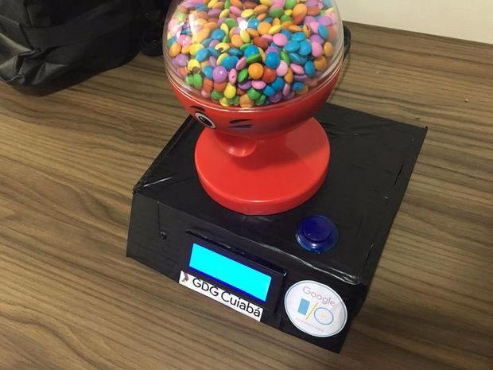

#### A candy dispenser running Android Things that exchanges photos for candies. It uses computer vision to classify the image.

The Android Things A.I. Candy Dispenser is a game that asks the user for a specific thing like a bird, dog or cat, and the user should show a photo of that thing in the predefined time to win candies.

The device (Raspberry Pi 3B) is running Android Things dev preview. It has a camera connected to take pictures, a 20x4 Serial i2c Display to show the "little" game state, a arcade button to interact with the game and a simple NPN transistor to activate the candy machine DC motor.

When the user takes a picture, it processes the image data using Google’s Cloud Vision API, which returns annotations and metadata of the image. This info is used by the device to see if it matches what was requested. When we have a match, the motor of the candy machine is activated and give the user the prize.



> Demo video

The code was made in Android Studio, using Kotlin Language and Google Vision API to classify the image. Please also note that this has only been tested on a Raspberry Pi 3, but should work on other compatible boards too. More details of this project can be seen on Instructables.

[Android Things A.I. Candy Dispenser](https://www.instructables.com/id/Android-Things-AI-Candy-Dispenser/)
