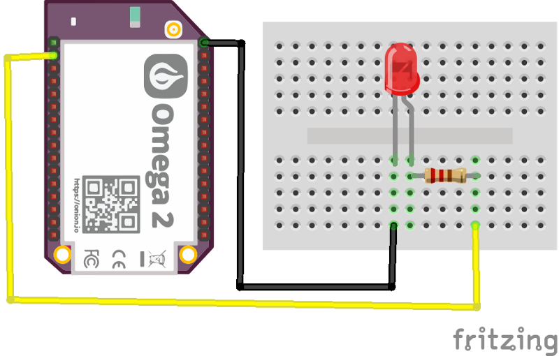

#### Exploring Go cross compiling capabilities on a small but powerful device like the Onion Omega2.



The Omega2 is a powerful device made by the people of [Onion.io](http://onion.io). It’s basically a computer that comes packed with built-in Wi-Fi, running a Linux Operating System based on OpenWRT, has many general purpose inputs and outputs, and comes with a powerful processor, all of this in a really small package, hoping that you build awesome IoT projects with it.



The board is based on the **MediaTek MT7688** processor (with a **MIPS** architecture) running at 580Mhz, comes with **64MB** of RAM and **16MB** of flash storage. It also has a version called **Omega2 Plus** that comes with the double of ram and storage. You can see more details at the onion docs.

In such a constrained environment we need options that use low memory and also has a small footprint. The official Onion docs offer the following options to program the device:

- **C Programming**: With this option, we’ll have a low memory usage and small footprint, but let’s be honest, programming in C is not for the good hearted, cross-compile is not trivial, we want an easier and high-level option.
- **Python, NodeJS or PHP Programming**: Those options are all good, but we are talking about languages that are interpreted and not so good in such constrained environment, besides that, just the interpreter for those costs about 8MB of storage, without leaving in consideration additional packages/modules that you’ll probably need to do something more advanced.

I will show you here how to use **Go** programming language (or **Golang)** to program the Omega2. It’s a simple, high-level language, with plenty of packages that can be used in your projects, awesome support for cross compiling and a small footprint. Our demo project, when compiled, generates a binary file just for the Omega architecture with a size of just **1MB**, using external packages and more. So let’s get started.

### Installing Golang on your computer

I think that one of the best tutorials on how to configure Golang on your environment was made by William Kennedy, it’s not worth rewriting if someone has done very well. Check it out if you don’t have Go installed yet:

> [Installing Go And Setup Your Workspace](https://www.goinggo.net/2016/05/installing-go-and-your-workspace.html)

I use on the daily basis Visual Studio Code for writing Go applications, I recommend it together with this awesome plugin that adds support for Go in it.

> [Microsoft/vscode-go](https://github.com/Microsoft/vscode-go)

### Creating our "Hello World"

As a tradition on hardware programming, I’ll show you how to blink a LED on the Omega2 using Golang. For that you have to create our project inside our workspace, the folders convention normally used is the following:
`$GOPATH/github.com/{your_username}/{project_name}`

So I’ll create the project `onion-golang-blink` using the following command to create the project folder:
`mkdir $GOPATH/github.com/alvarowolfx/onion-golang-blink`

Create a `main.go` file and put the following code, that just prints `Hello World`:



If you type `go run main.go` on your computer, it will compile the program and execute it, showing in the terminal the message `Hello World`. But that not what we want, we want to run this on the Omega2, but as we said before, it has a diferent architecture, so we need to cross-compile the project. Doing this in **C** it’s extremely painful, but you will see that the **Go SDK** already comes with all that is needed to compile to others architectures.

You just need to inform the target operating system and the target architecture using the environment variables **GOOS** and **GOARCH**. In this case, to compile for the 32bits MIPS architecture, we inform GOARCH=mipsle. Here is the command to compile the project to run on the Omega2:

```
GOOS=linux GOARCH=mipsle go build -o blink main.go
```

This will generate a binary file named `blink` that can run on the embedded device. Now we can copy to the Omega2 using any method that you want, I normally use `rsync`, but you can see more ways to transfer files to the device on the Onion docs.

> [Onion Omega2 Documentation](https://docs.onion.io/omega2-docs/transferring-files.html)

```
# Exchange XXXX for your Omega last 4 digits mac address
$ rsync -P -a blink root@omega-XXXX.local:/root
```

Now we can `ssh` into the Omega2 and run the command on the `/root` folder:

```
$ ./blink Hello World
```

### Using GPIO with Golang

If you reached here, you have all that is needed to compile and run Golang projects on the Omega2. Now we will effectively make a LED blink using the GPIO on the device. The schematic to connect the LED is shown below. We will use GPIO11 on the Omega2 to power on and off the LED.



One of the ways to interact with the GPIOs are using `sysfs`, that basically create a virtual filesystem that you can interact with it to change the outputs and read the input of the GPIOs. Luckily there is a Golang package that already abstract this and many other ways to interact with GPIO, so we’ll install it and use it on our project.

> [Periph.io website](http://periph.io/)

To install it run the following command on the terminal, then change our `main.go` with the contents below:

```
go get -u periph.io/x/periph
```



This code is pretty simple, we are opening a GPIO on pin 11, where our LED is connected, then we keep toggling the output state to blink the LED. Now our hardware Hello World is ready. Compile it using the same command that we used before and transfer it to the device. You should see your LED blinking 🎉.



### A more interesting example using `net/http` package

Golang has many awesome built-in packages, one of the most loved by the community is the `net/http` package, because with a little effort we can have a http server handling requests in our project.



Here we have a home page with a button to toggle the LED state and also the same methods that handle the button clicks can be used as JSON endpoints to turn on and off the LED, based on the request `Content-Type`. Here is the code to do this:



Run the code above on the Omega2 and access the web interface in your favorite browser with the url `[http://omega-XXXX.local:9090](http://omega-XXXX.local:9090)`, changing `XXXX` with your device last 4 digits mac address. You should see a web interface that you can interact with the project LED.

### Further Reading

That’s it for this tutorial, hope that you got interested in Golang, it is a awesome language that you can do powerful things with it. When we talk about IoT devices is really good to have such a high level language and do so much with less code, maintaing low memory usage and with such a small footprint.

The code for this project can be found on my Github:

> [Checkout project repository on Github](https://github.com/alvarowolfx/onion-golang-blink)

I made a another project with Onion + Golang, but rather then controlling it using http, I used a library that implements Homekit protocol, so I can control it using iOS Home App and with my voice using Siri.

> [Homekit + Golang + Onion](https://github.com/alvarowolfx/onion-golamp)

#### References

- [https://gobyexample.com](https://gobyexample.com)
- [https://github.com/brutella/hc](https://github.com/brutella/hc)
- [https://www.goinggo.net/2016/05/installing-go-and-your-workspace.html](https://www.goinggo.net/2016/05/installing-go-and-your-workspace.html)
- [https://golang.org/](https://golang.org/doc/code.html)
- [https://docs.onion.io/omega2-docs/index.html](https://docs.onion.io/omega2-docs/index.html)


