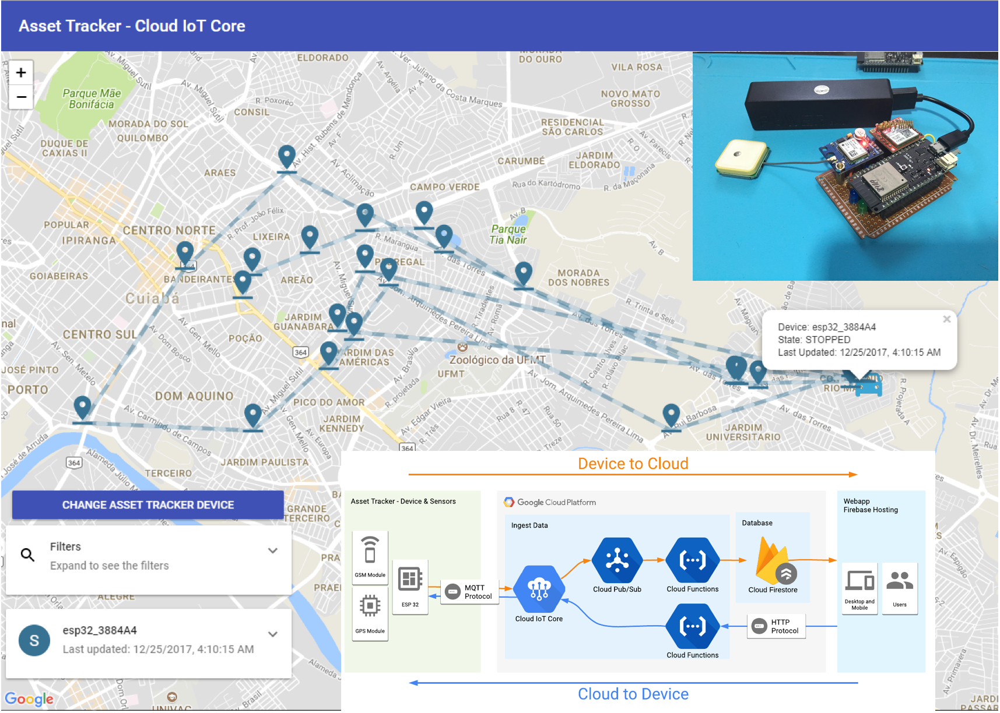
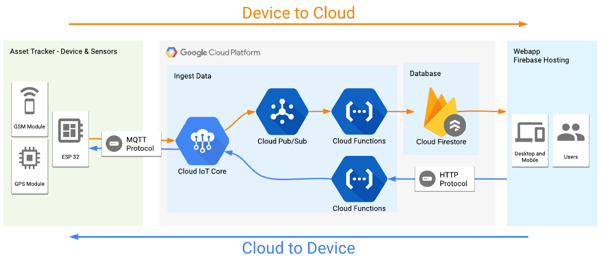
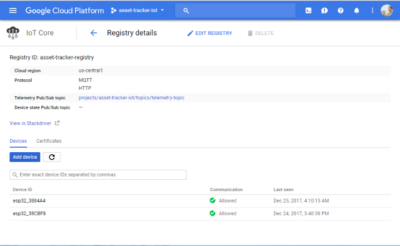
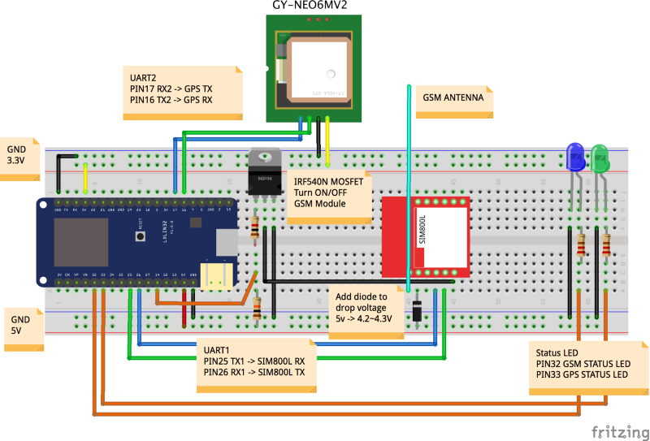
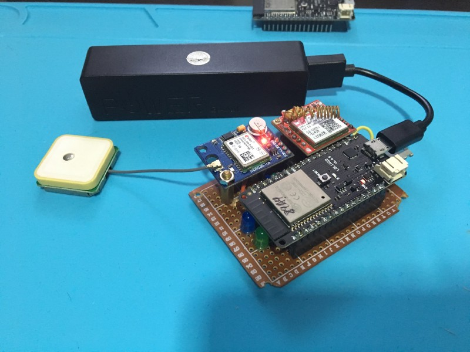
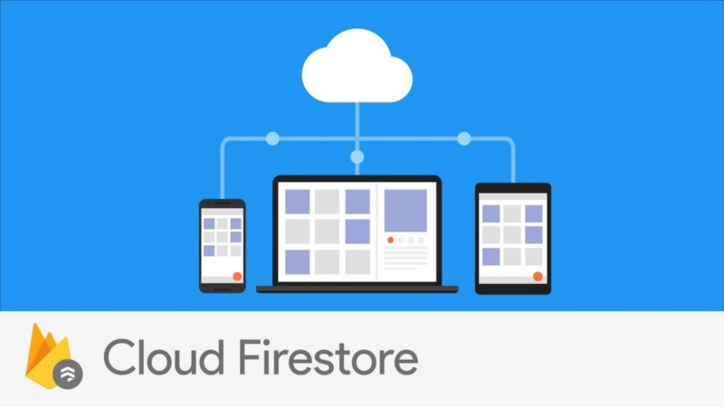
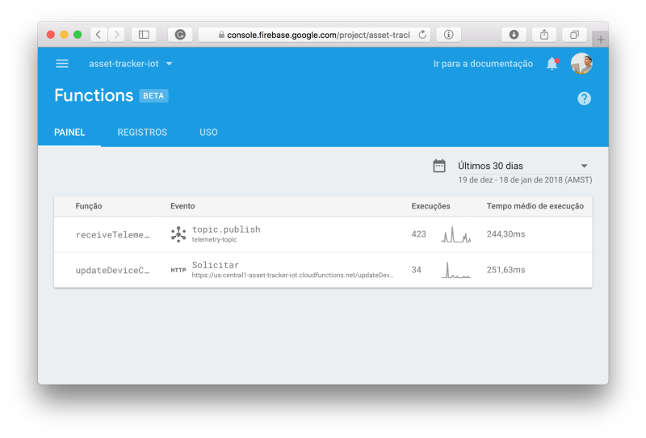
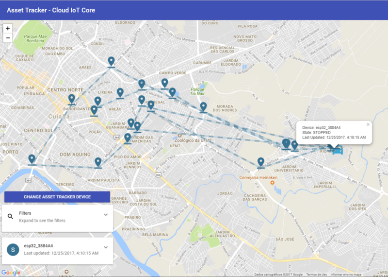
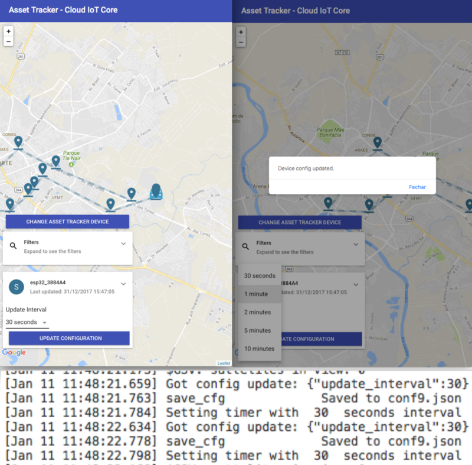

#### Track your goods anywhere and anytime with a GPS tracker sending location data over mobile network to an awesome cloud and serverless architecture.

One of the biggest problems logistics industry faces today is the tracking of assets and vehicles. We have a bunch of ways to resolve this problem, GPS and Cellular technologies have been around for a long time and in the most cases are enough to track a vehicle in almost real-time. Our project will use both of these technologies to achieve this goal. Check out how our app will look like at the end of this tutorial:


> Our awesome webapp to track our assets.

> You can access the WebApp at [https://asset-tracker-iot.firebaseapp.com/](https://asset-tracker-iot.firebaseapp.com/)

In this tutorial we will build an Asset Tracker using an **ESP32** microcontroller running **MongooseOS**, that sends data securely via **Cloud IoT Core** using MQTT protocol over mobile network, the data is processed in an event-based way using **Firebase Cloud Function**, saves the data and current device state in **Firestore.** The data then can be accessed through a **Progressive Web App** hosted on **Firebase Hosting**, with the possibility to even configure the device remotely, showcasing Cloud IoT Core bi-directional communication.

If you are confused by the many terms, I recommend you to read another post that I made about using Google Cloud for an IoT project. In this post, I explain in more details most of these products. Here I’ll be more succinct in the configuration of the project on Google.

[Build a Weather Station using Google Cloud IoT Core and MongooseOS](https://medium.com/google-cloud/build-a-weather-station-using-google-cloud-iot-core-and-mongooseos-7a78b69822c5)

Here we’ll be focusing on building an end to end architecture that handles the location data coming from our sensors in a secure way, store the data, show our fleet on a map in realtime. Our architecture will look like this:



> Our project architecture

### What we will learn

Making a project that relies on mobile network and with security in mind is not trivial. I’ll show how easy is to do this using **MongooseOS** and their awesome **PPPoS** library, that abstracts the network over GPRS/Cellular serial modules, making easier for us to build our products that depend on this kind of communication.

The security channel to send data using MQTT will be handled by Cloud IoT Core. All data received will be stored in Firestore database. Here is the summary of what we will learn:

- A quick recap of how to create a **Google Cloud IoT** project.
- Use **MongooseOS** with a serial GPRS module.
- What is Google newest **Firestore** ?
- Send data from device to the cloud and store it with **Firestore**.
- Send data from cloud to a device using Cloud IoT Core API.

#### Creating the project and services

To use the `gcloud` command line tools, [follow the instructions here to download and install it](https://cloud.google.com/sdk/downloads).

[Installing Cloud SDK | Cloud SDK Documentation | Google Cloud Platform](https://cloud.google.com/sdk/downloads)

After installing the SDK, you should install the beta tools to have access to the Cloud IoT Core commands. Also after this you should authenticate and create a project to use in this tutorial, exchange YOUR_PROJECT_NAME with a name that you want for this project:

```bash
# Install beta components:
gcloud components install beta
# Authenticate with Google Cloud:
gcloud auth login
# Create cloud project — choose your unique project name:
gcloud projects create YOUR_PROJECT_NAME
# Set current project
gcloud config set project YOUR_PROJECT_NAME

```

Create a Cloud IoT Registry where the devices will be registered to send data.

```bash
# Add permissions for IoT Core
gcloud projects add-iam-policy-binding YOUR_PROJECT_NAME --member=serviceAccount:cloud-iot@system.gserviceaccount.com --role=roles/pubsub.publisher
# Create PubSub topic for device data:
gcloud beta pubsub topics create telemetry-topic
# Create PubSub subscription for device data:
gcloud beta pubsub subscriptions create --topic telemetry-topic telemetry-subscription
# Create device registry:
gcloud beta iot registries create asset-tracker-registry --region us-central1 --event-pubsub-topic=telemetry-topic
```

If you access the Google Cloud Console you can validate that everything is created and configured.



Registry created and associated with a PubSub Topic

### Setup the hardware

In this section, I’ll show how to setup the asset tracker, all modules needed and how to program the board with our code.

#### Components

The heart of our project will be an ESP32 WiFi microcontroller, it has many flavors out there and as far as I known, any model will work.


> Mongoose OS & Google IoT Core Pack w/ Adafruit Feather HUZZAH32 — [https://www.adafruit.com/product/3606](https://www.adafruit.com/product/3606)

Here is the project component list:

- Any ESP32 Board (I used a Lolin32).
- NEO 6M uBlox GPS module.
- Sim800L GSM module.
- 220 Ohm resistors for the LEDs.
- Blue and Green LED for status of the device.
- 1k and 10k Ohm resistors for the MOSFET trigger.
- IRF540N MOSFET (don’t try to use a cheap MOSFET, like the TIP120, because it cannot handle the GSM Module current needs)
- A 1n4007 drop voltage diode, for powering the GSM module.
- Jumpers
- Perfboard for prototype (Optional)

Our schematic is the following:



> Project schematic

The schematic, in general, is pretty simple. Maybe the only weird part is the GSM module connections. I put a MOSFET to switch on and off the module because it consumes a lot of energy. Making this I can use less energy and put the device to sleep when I’m not sending data. Another detail is the usage of a diode to drop the voltage to power the GSM module with 4.2v, because powering it with 3.3v or 5v is considered under-voltage and over-voltage respectively by the module.



> Here is the project assembled on a perfboard.

#### Programming the hardware and associate with our project

To program the board we will use MongooseOS. It has a tools called _mos_ that make programming, provisioning and configuration really easy on the supported boards. To use it we need to download and install it from the official website. Follow the installation instructions on [https://mongoose-os.com/docs/quickstart/setup.html](https://mongoose-os.com/docs/quickstart/setup.html).

[Mongoose OS Documentation](https://mongoose-os.com/docs/quickstart/setup.html)

With the tools installed, download the project code on [Github repository linked here](https://github.com/alvarowolfx/asset-tracker-gcp-mongoose-os), so you can build and deploy it on the device.

[alvarowolfx/asset-tracker-gcp-mongoose-os](https://github.com/alvarowolfx/asset-tracker-gcp-mongoose-os)

The repository consists of **3 sub-projects**:

- **firmware**: the MongooseOS project that runs on the microcontroller, that collects location data and sends through Cloud IoT Core using cellular network.
- **functions**: the Cloud Functions that will be deployed to on **Firebase**. Here we have a function that reacts to new data on PubSub and saves it on **Firestore**. There is another function that it’s basically an HTTP endpoint that is used to send data from cloud to the device and configure the update interval. It will be used by our WebApp so the user can configure the update interval of our device.
- **public**: a WebApp built with React that will be deployed on Firebase Hosting and it consults our database to show our devices on a map and interact with them. The project was created using `create-react-app`.

I will detail a little more each project in the next sections.

#### Firmware project

Here some description of the **firmware** project:

- **fs/init.js**: Here we have our Javascript code that contains all logic to collect the data and send through MQTT in a configurable interval.
- **mos.yml**: Our project configuration, here we declare our project dependencies, in this case, the GCP, PPPoS, GPS and mJS libraries, the last one adds support for Javascript embedded. Here we declared a config variable named **app.update_interval,** this way we can change the update interval just by changing this configuration that can also be changed via _mos_ tool or via code. I also turned off WiFi to use less power on the microcontroller with the **wifi.sta.enable** config.

- In the **mos.yml** file we can see the configuration for the PPoS and GPS. You must change it to your SIM Card network APN configuration to make it work. You can also change the UART port being used by the project, depending on your ESP32 model.

Now take a look a the device code, most of its functions have a little comment. Basically the device flow is the following:

- Try to connect to the MQTT server and turn on/off the GSM Led.
- Try to get some GPS data and then turn on/off the GPS Led.
- If it’s all working it publishes data through MQTT.
- After publishing, the device shut down the GSM module after a while (to give time to publish the message) then enter in deep sleep mode.
- After coming back from deep sleep, the devices reset itself and start all over again.
- If the devices take too long to publish data, it also enters into deep sleep mode to preserve battery.

To program the hardware, enter the **firmware** folder and run the following instructions to flash the firmware, configure WiFi and provision the device on Cloud IoT Core:

- Run `mos build --arch esp32` depending on the hardware selected. This command builds the firmware of our hardware.
- Run `mos flash` with the hardware connected through USB to flash the firmware.
- Run the following command to register this device on Cloud IoT Code. The command generates a public and a private key to be used for the communication, put the private key on the device, send the public key to Cloud IoT core and register the device, getting the deviceId from ESP. Thanks MongooseOS ❤.`mos gcp-iot-setup --gcp-project **YOUR_PROJECT_NAME** --gcp-region us-central1 --gcp-registry **YOUR_REGISTRY**`

That’s it, your device will begin to collect location data, connect to the cellular network and send data to Cloud IoT Core. You can see whats happening on the device using the `mos console` tool. You will see it trying to connect to the cellular network and to _mqtt.googleapis.com_. Here is some output from `mos console`, I omitted some junk messages:

```
$ mos console
Using port /dev/cu.SLAB_USBtoUART
[Jan 17 11:18:00.762] mgos_net_on_change_c PPP: connecting
[Jan 17 11:18:00.772] == Net event: 1 CONNECTING
[Jan 17 11:18:00.811] mgos_pppos_uart_disp Starting PPP, user "tim"
[Jan 17 11:18:00.818] mgos_net_on_change_c PPP: connected
[Jan 17 11:18:00.827] == Net event: 2 CONNECTED
[Jan 17 11:18:00.833] mongoose_poll New heap free LWM: 218968
[Jan 17 11:18:01.559] mgos_net_on_change_c PPP: ready, IP 179.11.108.69, GW 192.168.254.254, DNS 189.40.198.80
[Jan 17 11:18:01.572] == Net event: 3 GOT_IP
[Jan 17 11:18:01.579] mgos_mqtt_global_con MQTT connecting to mqtt.googleapis.com:8883
[Jan 17 11:18:01.827] $GGA: fix quality: 0
[Jan 17 11:18:01.832] $GSV: sattelites in view: 3
[Jan 17 11:18:02.498] mgos_sntp_query SNTP query to pool.ntp.org
[Jan 17 11:18:09.730] mongoose_poll New heap free LWM: 206328
[Jan 17 11:18:09.810] mgos_mqtt_ev MQTT TCP connect ok (0)
[Jan 17 11:18:10.834] mgos_sntp_ev SNTP reply from 200.160.7.186: time 1516198687.979016, local 27.250466, delta 1516198660.728550
[Jan 17 11:18:24.767] mgos_mqtt_ev MQTT CONNACK 0
[Jan 17 11:18:24.774] MQTT CONNECTED
[Jan 17 11:18:24.782] do_subscribe Subscribing to "/devices/esp32_3884A4/config" [Jan 17 11:18:26.182] Got config update: {"update_interval":120}
[Jan 17 11:18:26.291] save_cfg Saved to conf9.json
[Jan 17 11:18:26.312] Setting timer with 120 seconds interval
[Jan 17 11:18:29.304] Published
[Jan 17 11:18:29.307] Sleeping
[Jan 17 11:18:37.316] Turning off all devices
```

I recommend taking a walk with the device to generate data and also sometimes I have problems to get GPS and GPRS to connect inside my house. To see the data on PubSub you can use `gcloud` command to query the subscription that we created:

```
$ gcloud beta pubsub subscriptions pull --auto-ack telemetry-subscription
┌──────────────────────────────────────────────────────────────────────────────────────────────────────────────────────────────────┬────────────────┬─────────────────────────────────────────┐
│                                                               DATA                                                               │   MESSAGE_ID   │                ATTRIBUTES               │
├──────────────────────────────────────────────────────────────────────────────────────────────────────────────────────────────────┼────────────────┼─────────────────────────────────────────┤
│ {"latlon":{"sp":"0.197133","lon":"-56.082420","lat":"-15.581032"},"temp":53.333333,"free_ram":214.191406,"total_ram":287.621094} │ 22138603640541 │ deviceId=esp32_3884A4                   │
│                                                                                                                                  │                │ deviceNumId=2569363294223005            │
│                                                                                                                                  │                │ deviceRegistryId=asset-tracker-registry │
│                                                                                                                                  │                │ deviceRegistryLocation=us-central1      │
│                                                                                                                                  │                │ projectId=asset-tracker-iot             │
│                                                                                                                                  │                │ subFolder=                              │
└──────────────────────────────────────────────────────────────────────────────────────────────────────────────────────────────────┴────────────────┴─────────────────────────────────────────┘
```

If you see the data on the console, you can start celebrating, we are on the right path 🎉🏆.

#### Cloud Firestore Database and backend with Firebase Cloud Functions



The **Cloud Firestore** is like a merge of **Google Datastore** and **Firebase Realtime Database**, with some features like document and collections definitions, real-time data synchronization, data replication and SDK for many languages. One of the most exciting news to me is that you have the same ease-of-use of all the Firebase products and in comparison with Firebase Database now we have a much better support for advanced queries and data modeling.

For this project I choose Firestore because of these features:

- Maintain devices state in a **collection** named `devices` and all of the location data sent by each device in a **subcollection** named `location_logs`. Each collection can contain a lot of documents with a flexible schema, this way Firestore enables us to have a better organization of our data and more powerful querying capabilities that scale better.
- We can have **realtime updates** on our clients, so we can see the most current data in the moment that it arrives.
- We don’t need to maintain or scale our database: Cloud Firestore scales with your data and have all the SDKs needed to start making our applications. **Awesome serverless development**.

This project uses Firebase Cloud Functions to handle all the custom rules and backend services that our application need. The code can be seen below, but there are some settings that can be changed in the project:

- **REGION** and **REGISTRY**: You need to change to your project region and the name of your Cloud IoT core registry using those variables.
- **DISTANCE_THRESHOLD: C**ontrol whether we consider the new location data to be a considerable movement of the device ou if I will consider as my device is in the same place. My default setting is to consider 50 meters.

Here are some details on each function that is running on the Cloud in reaction to our events:

- **exports.updateDeviceConfig:** HTTP endpoint that our webapp uses to change the device configuration. The function receives a deviceId and a updateInterval, then call the method modifyCloudToDeviceConfig method of Cloud IoT Core to update the device configuration. We used Google APIs directly, until today we don’t have an official library for Cloud IoT Core (see **getCloudIoTClient** function). Also when sending a new updated config to the device, the data must be in a Base64 format, but the device receives it already parsed in JSON format.
- **exports.receiveTelemetry:** This function that reacts to every data that arrives on Cloud IoT Core configured PubSub topic. This function does most of the hard work, it maintains the device last data on Firestore and also sees if there is a significant movement to insert the new data on the location_logs subcollection.
- **updateDeviceDateIndex:** This function is an especial one, here I maintain an index of how many location points is stored for each day for each device, this way we can know what dates to show on the UI without having to do a heavy query on the location logs. When we are working with NoSQL Databases, sometimes we have those **trade-offs** to achieve better performance.

To deploy our functions we need the _Firebase Command Line Tools,_ it requires Node.JS and npm[,](https://www.npmjs.org/) which you can install by following the instructions on [https://nodejs.org/.](https://nodejs.org/) Installing Node.js also installs npm. Once Node and NPM is installed, run the following command to install Firebase CLI.
`npm install -g firebase-tools`

Now to configure firebase with our project and deploy the functions, in the project root folder, follow the above instructions:

- Run `firebase login` to authenticate with Google and setup the command line tools
- Run `firebase init` to associate the local project with your Firebase Project.
- Install cloud functions dependencies with the command `cd function & npm install.`
- And finally run `firebase deploy --only functions` to deploy only our functions, as our webapp first need to be build before it can be deployed.

With the deployed functions you have all setup to store our received location data sent by the device and execute our custom rules on how to store it. You can see and monitor all deployed resource on the Firebase Console.


You can see executions and the logs of our functions running on Firebase.

Now it’s time to deploy our WebApp.

#### The WebApp project made with React

For this part of the project, I’ll not enter into too many details because it’s not the main subject for this post, but I’ll highlight some methods that make access to Cloud Firestore.


Our awesome webapp to track our assets.

Here are some of the most important functions for the WebApp, where it access data on Firestore and call our endpoint to update device configuration:



> Updating the device configuration.

For this app, I used an awesome tool called create-react-app that configures a really good project structure and tools to work with modern Javascript, in this case using React. For those who don’t know it, I recommend to check it out on their [official blog](https://reactjs.org/blog/2016/07/22/create-apps-with-no-configuration.html).

[Create Apps with No Configuration - React Blog](https://reactjs.org/blog/2016/07/22/create-apps-with-no-configuration.html)

In the last section we already installed NPM, so now we only have to install all project dependencies and build it to production. Here are some commands that come configured with `create-react-app` :

- Running `npm install` on the project main folder that all the dependencies will be installed.
- To run the local server you can run the `npm start` command. This will start a live reload server and will also show some lint errors in our code. Really awesome.
- To build our project you can run the `npm run build` command. This will prepare our code and assets for production and put all of it in the `build` folder.

After building our project we can now run `firebase deploy` and have all of our project deployed on Firebase infrastructure.



If all it’s correctly setup, then we have another end to end solution created using many awesome tools and better yet: Without touching an advanced and boring server setup.

#### Further Reading

That’s it for this project, we have a really cool asset tracker prototype that uses many new features of Google Cloud and some IoT tools. Hope you guys enjoy this project and I’ll continue to explore more projects using those tools.

The code for this project can be found on my Github and some interesting are linked in the section bellow to read later:

> [Check out this project code on Github](https://github.com/alvarowolfx/asset-tracker-gcp-mongoose-os)

- [https://github.com/mongoose-os-libs/pppos](https://github.com/mongoose-os-libs/pppos)
- [https://cloudplatform.googleblog.com/2017/09/announcing-Cloud-IoT-Core-public-beta.html](https://cloudplatform.googleblog.com/2017/09/announcing-Cloud-IoT-Core-public-beta.html)
- [http://mongoose-os.com/gcp](http://mongoose-os.com/gcp)
- [https://cloud.google.com/iot/docs/quickstart](https://cloud.google.com/iot/docs/quickstart)
- [https://mongoose-os.com/docs/libraries/cloud_integrations/gcp.html](https://mongoose-os.com/docs/libraries/cloud_integrations/gcp.html)
- [https://github.com/alvarowolfx/asset-tracker-gcp-mongoose-os](http://github.com/alvarowolfx/asset-tracker-gcp-mongoose-os)
