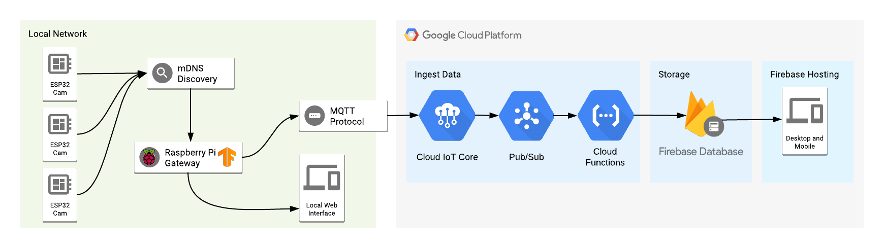
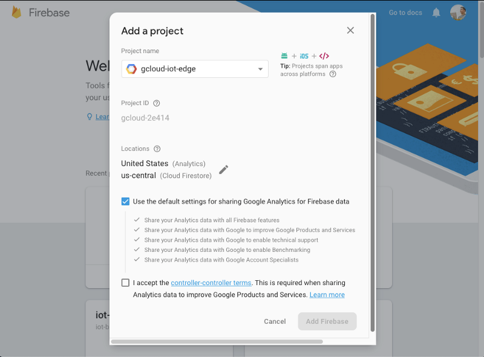

#### An experiment involving ESP32 with cameras, a Raspberry Pi running Tensorflow inferences on the edge, acting as a Cloud IoT Core Gateway and a serverless layer on the cloud to store all the data.

Check out how our finished application will look like at the end of this tutorial:





### What is Edge Computing?

We moved from using local servers running on centralized data centers to remote servers that process and store all of our data, that we call Cloud Computing. Some of the reasons to move to the cloud are for ease of usage, scalability and reducing the cost for maintaining all the underlining infrastructure for our services.

But for some cases, we still need to process data close to where the things happen — that what we call Edge Computing.

There are many reasons to use Edge computing, here we can see some scenarios that this can be applied and the example for this post will go through some of those scenarios:

- **Response time and having access to the system is important , even when the internet is down**: for example, for home automation, does not make sense to not be able to control your house when you are inside of it but the internet is down, but you still want to access your house outside of it through the cloud. Also, in the context of a self-driving car, things need to be processed locally and have an instantaneous response time to work reliably and avoid major problems.
- **Use less network bandwidth**: this can be seen on Netflix, that use local caches distributed on many cities around the globe to reduce the overall network transfer costs and load related with video streaming, also giving us users a much better overall experience.
- **Privacy**: sometimes the data should stay only close to the users, sending the minimal amount of data to the cloud with the objective of improving the user experience, like enabling the user to control remotely.
- **When processing everything in the cloud becomes too expensive**: If we can process some of the workloads locally and then sending just the important data to the cloud, we can archive huge cost savings. Running machine learning or processing image data can be really expensive in the cloud, both on the bandwidth side and processing power, so if we can run this locally we can have a lot of gains and costs savings.

The idea here is to use some cheap cameras that provide us with an interface to fetch images, a local server that searches for those local cameras and processes their images using machine learning and computer vision, then sends the processed data to the cloud, so we can monitor and treat the cameras as a sensor by knowing the content of the images. We can use this to track people on a house or building, receive an alert if a wild animal appears outside of our house or in a public space, or even train a custom model and only allows authorized personnel to walk around a place. There are many use cases for using a camera as a sensor.

In this tutorial, we are going to use some **ESP32 module with an integrated camera** as our cheap wifi cameras. Use a **Raspberry Pi** board as a local server (you can use your computer instead), that will run image classification using **Tensorflow**, and some pre-made models that are good enough for classifying and detecting objects on images. The classified data is sent to the cloud securely using **Cloud IoT Core** and also leveraging the new **gateway** feature, so the local server can act on behalf of the camera modules for sending data to the cloud. Then the data is processed in an event-based way using **Firebase Cloud Functions**, that basically stores data on **Firebase** to make the data available to internet connect users on a web interface deployed on **Firebase Hosting**. Also, the local server will provide a local web interface to monitor the cameras.

Here an overview of our architecture :


After this quick introduction to edge computing and our project, let’s start by programming our cameras with the firmware to serve the images.

### Flashing the ESP32 camera modules using PlatformIO

Nowadays there is a lot of ESP32 modules being seems in the wild with an integrated camera, that can be found ranging from 9$ to 15$. Here you can see some models that being sell online that can be used for this project. I personally used the ESP32Cam and M5Stack Cam.



For this project, I programmed the firmware for the cameras using the native Development Framework for Espressif modules  —  **ESP-IDF**. I choose this one because it has more access to all features of the boards and also has more examples of how to use connect the cameras with the ESP32. Usually is a bit hard to get started with ESP-IDF but using **PlatformIO** makes it much easier to get started with it.

> [Espressif esp-idf SDK on Github](https://github.com/espressif/esp-idf)

**PlatformIO** is a set of cross-platform tools for developing for embedded devices. It supports a lot of different platforms and frameworks for IoT development and also a huge set of libraries made by the community that can be easily used on your project.

I recommend installing the Visual Studio Code (VSCode) IDE and the PlatformIO plugin to get started using it. Just follow the step on the link below:

> [PlatformIO: An open source ecosystem for IoT development](https://platformio.org/platformio-ide)



The code for this project is available on the following Github link. Clone or download the project the code and open the **esp32-camera-firmware** folder on the IDE.

> [See project on this article on Github](https://github.com/alvarowolfx/gcloud-iot-edge-tensorflow)

There are some configuration changes that have to be done to set up the project. Most important ones are the wifi credentials, that can be found on the **sdkconfig.h** file: **CONFIG_WIFI_SSID** and **CONFIG_WIFI_PASSWORD**. Also on the **platformio.ini** file, there is an environment configuration to choose the board model that you are using, either ESP32-Cam or ESP32 M5Stack.

If you are using the ESP32-Cam board, you will need a 3.3v FTDI module to connect to the module and flash the firmware. Just connect the **UOT** and **UOR** pins from the module to **RX** and **TX** on the FTDI module and also the ping necessary to power the board, 3.3v and GND. Then connect the pins **IO2** and **IO0** to **GND** to put the board in flash mode and to be able to program it.



The firmware basically provides an HTTP endpoint to get an image from the module and also publishes an mDNS service for the gateway to query and find all cameras available to process the images. The device publishes a **\_camera** service, using **\_tcp** protocol and the instance name of each device is based on the internal chip ID of the ESP32.

To query mDNS services we can use the command **dns-sd** like on the command below and we can see in the output that it found two camera devices running our desired service:

```bash
$ dns-sd -B _camera._tcp .
Browsing for _camera._tcp
DATE: - -Sun 16 Dec 2018 - -
19:55:04.135 …STARTING…
Timestamp A/R Flags if Domain Service Type Instance Name
19:55:04.136 Add 3 6 local. _camera._tcp. indoor-camera-ec5d
19:55:04.137 Add 2 6 local. _camera._tcp. indoor-camera-60d8
```

To see some images, just access **{INSTANCE_NAME}.local/jpg** in a browser to see the camera image. As an example of URLs, given the above output, those URLs are valid ones:

```
http://indoor-camera-ec5d.local/jpg
http://indoor-camera-60d8.local/jpg
```

Now that our camera nodes are up and running, we can move forward to our gateway.

### Provisioning gateway and devices with Google Cloud

The local server will act as a gateway and will send the data on behalf of the sensor nodes. Google Cloud just launched a new feature on Cloud IoT Core that enables us to create gateways that do exactly that, so this is the perfect opportunity to learn this.



> [Overview | Google Cloud Internet of Things Core | Google Cloud](https://cloud.google.com/iot/docs/how-tos/gateways/)

But first, we need to set up some resources to start using Cloud IoT Core. Let’s go through the steps required to do this on Google Cloud:

- Enable Cloud IoT Core and PubSub.
- Create telemetry and state topics on PubSub to be used on Cloud IoT Core.
- Create a subscription to the above topic for debugging purposes.
- Create Cloud IoT Core Registry, that will contains all managed devices.
- Generate key pair certificates for the gateway to connect to the cloud.
- Register the Cloud IoT Gateway using the above keys.

I made a script available on the project repository that we can use to automate all those steps. This way we need to just execute it like this to have everything set up:

```
./setup.sh PROJECT_NAME
```

Running the script will create some extra files, **ec_public.pem** and **ec_private.pem** certificates that will be used later. The public certificate is associated with the gateway and is registered on Cloud IoT Core to validate gateway connection and the private certificate will be used by the gateway to send data.

Now to register devices on Cloud IoT Core and bind to the gateway, there is a script on the project repository that can be used to make this task easy:

```
./register-device.sh PROJECT_NAME DEVICE_ID
```

Only registered devices will be able to send data through the gateway, so we need to register and bound all the ESP32 cameras with the gateway. After that, we can talk about the implementation of the gateway.

### Gateway using Tensorflow and NodeJS

The gateway basically has to search for the local cameras using mDNS, classify the images, send the data to the cloud and provide a web interface to access the data locally. The code for this project is also available on Github on the **edge-server** folder.

> [Check this project repository on Github](https://github.com/alvarowolfx/gcloud-iot-edge-tensorflow)

I choose **NodeJS** because it’s one of the easiest ways to get started with Tensorflow in my opinion. There is an NPM package called **@tensorflow/models** that contains a lot of pre-made machine learning models that can be used for a lot of different purposes and kinds of data. You can take a look at the website to read more about it.

> [TensorFlow.js Website](https://js.tensorflow.org/#getting-started)
>
> [Check out tensorflow/tfjs-models repository](https://github.com/tensorflow/tfjs-models)

Here is a break down of the classes that can be found on the project that is closely related to the flow that I described earlier.



- **DeviceListener:** Responsible for searching the cameras using mDNS, maintaining a list of devices on the local network and emitting events when devices are online or offline.
- **ImageClassifier:** Receives an image and detects objects using Tensorflow. For this project, I used the **CocoSSD** pre-trained model that is available on the **tfjs-models** package.
- **CloudIoTCoreGateway** : Handles all the communication and authentication with Cloud IoT Core and also acts as a Cloud IoT Core Gateway.
- **WebInterface**: Provides a web server that serves a web UI and also a real-time engine to sync data with the browser using [socket.io](http://socket.io).
- **EdgeServer**: Uses all of the above classes, fetching images from the active devices, passing those images through the classifier, then sending data to Cloud IoT Core and providing the data to the local web interface.





To run the server, just install the project dependencies using NPM and run the server. To run on Linux we need to install some mDNS dependencies to be able to discover services locally.

```bash
# Install libavahi to make mDNS work.
sudo apt-get install libavahi-compat-libdnssd-dev

# Install dependencies and run the server
npm install node index.js
```

Now the gateway is collecting data from the cameras, sending the processed data to the cloud and also has a local web UI, that runs by default on port 3000. On the web interface, you can access to see the cameras images and classification results. An example image of it working bellow.



### [Extra] Using Tensorflow.js fork for Raspberry Pi

If you are using this server code on your computer you can skip to the next section, because this is specific for Raspberry Pi. There is an extra step to run on Raspberry Pi because there is no pre-build native library available for ARM boards, just the Python bindings are available. Actually, you can run on the Raspberry Pi without this, but the performance will not be the same as using a native library. So, I had to build **libtensorflow** from the source to be able to have those optimizations.

I made a fork of **tfjs-node** that works with Raspberry Pi and I already sent a Pull Request to the repository owners, but by the time that I’m writing this, it was not accepted yet.

> [Check my tfjs-node fork on Github](https://github.com/alvarowolfx/tfjs-node)

If you are using this server code on your computer you can skip to the next section, because this is specific for Raspberry Pi. To use my fork, you have to build the library and use locally. To do so, just follow the instructions :

```bash
# Download source
git clone https://github.com/alvarowolfx/tfjs-node
cd tfjs-node
git checkout add-armv7l-binding # branch with fix

# Install library dependencies
sudo npm i -g yarn yalc
npm install
npm run publish-local

# Now enter the project folder
yalc add @tensorflow/tfjs-node
npm install
```

And that’s it, you can now run the gateway code on a Raspberry Pi.

### Processing data using Cloud Functions and online web interface.

The next step is to process the data being received thought Cloud IoT Core, which in this case we are going to use Firebase Cloud Function.

Firebase Cloud Function is a serverless solution to execute code in the cloud. In this particular case, as Cloud IoT Core sends data to a PubSub topic, so we are going to deploy a function that reacts to new messages on those topics and save the data on Firebase Database. The code for the cloud functions is also available on Github on the **functions** folder.

> [Check out this project repository on Github](https://github.com/alvarowolfx/gcloud-iot-edge-tensorflow)

Believe me or not, but all the code necessary to process our incoming data with a cloud function can be seen below. Basically, we listen to both **telemetry** and **state** topics that were set up on Cloud IoT Core and then we update the data on Firebase.



Also on the **public** folder of our project, you can find our web interface that we are going to publish on **Firebase Hosting** and access the data that is being stored in Firebase.

To deploy our functions and web interface we need the _Firebase Command Line Tools._ To do that, run the following command to install.

```
npm install -g firebase-tools
```

Now to configure firebase with our project, deploy the functions and the web interface, first go to [console.firebase.google.com](https://console.firebase.google.com/u/0/) and associate your Google Cloud project to a new project on Firebase.



Then, on the project root folder, follow the instructions below:

```bash
# Authenticate with Google and set up the command line tools.
firebase login

# choose your firebase project name, to associate the local project
firebase user --add

# Install all the cloud functions dependencies
cd functions && npm install

# Deploy our functions and webapp
firebase deploy
```

With the deployed functions you have all set up to receive and store all of the data that is being sent by the gateway. Also, the web interface is going to be available on [https://YOUR_PROJECT_NAME.firebaseapp.com](https://YOUR_PROJECT_NAME.firebaseapp.com), which you can access and see all the data store on Firebase. In my case the URL is [https://gcloud-iot-edge.firebaseapp.com](https://gcloud-iot-edge.firebaseapp.com).



And now everything is set for this project. We created an end to end edge computing solution using many awesome tools, going from machine learning with Tensorflow, firmware for our cameras, server-side code with NodeJs and some nicely made web interface for our end users.

### Conclusion

Hope that with this article you had a good overview in practice on what parts are involved on an edge computing project. There is a lot of different scenarios for applying those concepts and also by using cameras as sensors. I added some future ideas to improve the current project and please, let me know if you have more ideas related to that.

- **Use pose detection models**: We can identify possible accidents on a workplace, by classifying the images looking for people that fell for example.



- **Triggers** and **alerts** depending when a set of classes are found in a room.
  

- **Train a custom model:** We can use a custom model to identify specific people on a building and for example, send an alert if an unauthorized person is found in a given room.
  

### References:

- [Why Do We Need Edge Computing? | Cloud Computing | IoT For All](https://www.iotforall.com/edge-computing-benefits/)
- [https://www.seeedstudio.com/ESP32-CAM-Development-Board-with-camer-p-3153.html](https://www.seeedstudio.com/ESP32-CAM-Development-Board-with-camer-p-3153.html)
- [https://www.cnx-software.com/2018/09/30/esp32-cam-esp32-camera-board/](https://www.cnx-software.com/2018/09/30/esp32-cam-esp32-camera-board/)
- [http://jamesthom.as/blog/2018/08/07/machine-learning-in-node-dot-js-with-tensorflow-dot-js/](http://jamesthom.as/blog/2018/08/07/machine-learning-in-node-dot-js-with-tensorflow-dot-js/)


