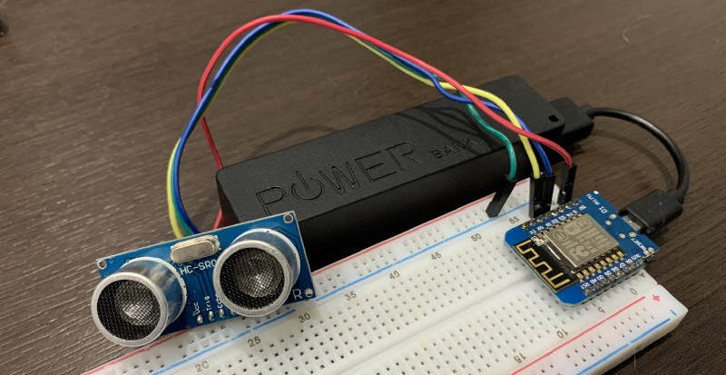
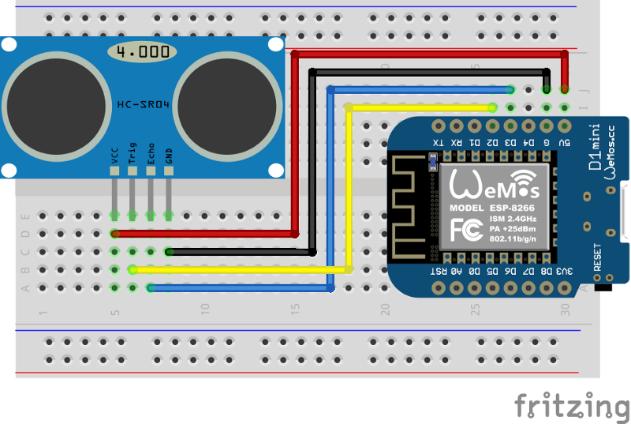

#### End to end solution to track tank level using cloud computing without having to worry too much with managing infrastructure.

This is a 3 part tutorial on how to create a farm tank monitoring solution on Google Cloud.

- Part 1 — [Build a Rest API using Cloud Run and Django Rest Framework](/articles/2020/2020-01-06_iot-tank-monitoring-solution-part-1build-a-rest-api-using-cloud-run-and-django-rest-framework)
- Part 2 — MicroPython device to collect tanks data
- Part 3 — [Visualizing data using BigQuery Federated Queries and Data Studio](/articles/2020/2020-01-06_iot-tank-monitoring-solution-part-3visualizing-data-using-cloudsql-federated-queries-bigquery)

In this part of this series of tutorials, I’ll go through the steps to build an IoT device to collect level data using fairly cheap WiFi devices and a ultrasonic sensor using MicroPython.


### Schematic and Parts



- ESP8266 WiFi Microcontroller
- HC-SR04 Ultrasonic Sensor
- Jumpers



### Installing MicroPython on the device

First we need to install the MicroPython environment on the device. To do that we need to go to MicroPython website and download the binary related to the device that you’re a going to be using.

> [MicroPython — Python for microcontrollers](http://micropython.org/download#esp8266)

Them we need to install esptool to be able to flash the device on our computer and we will use ampy tool from Adafruit to talk with the MicroPython device and copy code into it. You can run the following command to install both:

```
pip install esptool ampy
```

Now identify what is the board port on your computer. On Unix system you can run `ls /dev/tty.*` to list the serial devices. Some of my board for example are `/dev/tty.SLAB_USBtoUART` and `/dev/tty.usbserial-1410*`. Now, clean the device and flash the MicroPython firmware with the following commands :

```
export SERIAL_PORT=/dev/tty.SLAB_USBtoUART
esptool.py — -port $SERIAL_PORT erase_flash

# for ESP8266
esptool.py — port $SERIAL_PORT — baud 460800 write_flash — flash_size=detect 0 esp8266–20170108-v1.8.7.bin
```

Now with MicroPython running on the device it’s time to copy project files and set up some configuration to start sending data.

### Setup code on device and configuration

> [See firmware folder on Github](https://github.com/alvarowolfx/cloud-run-django-rest-iot/tree/master/firmware)

Clone the project files on your computer. The device related files are on the firmware folder. Change the config.py file there with your WiFi credentials and also the URL that the backend is running, so the device can send data to it.

To read data form the ultrasonic sensor I’ve used this library here [GitHub — rsc1975/micropython-hcsr04: Micropython driver for ultrasonic sensor HC-SR04](https://github.com/rsc1975/micropython-hcsr04) After that, copy the files to the device.

```
export SERIAL_PORT=/dev/tty.SLAB_USBtoUART
ampy — p $SERIAL_PORT -d 0.5 -b 115200 put firmware/config.py
ampy — p $SERIAL_PORT -d 0.5 -b 115200 put firmware/hcsr04.py
ampy — p $SERIAL_PORT -d 0.5 -b 115200 put firmware/sensor.py
ampy — p $SERIAL_PORT -d 0.5 -b 115200 put firmware/main.py`
```

And that’s it, the code is going to use part of the device Mac Address as the device ID and starting sending distance data to our backend every 10 minutes by default. You can debug the device reading from the serial port:

```
screen -L $SERIAL_PORT 115200 -L
```

And here is an example output:

```
connecting to network...
network config: ('192.168.0.120', '255.255.255.0', '192.168.0.1', '192.168.0.1')
Distance = 13.1838cm
sending:  {'distance': 13.1838, 'device_id': '487ada00'}
data sent!
```

### Conclusion

This part is a relatively short, but is just to show how simple we can prototype a solution using MicroPython and some cheap devices. As always, there is room for improvements here as mentioned on part one, but there is one specific to the device.

We can add device authentication, there is a really good article showing how to use IoT Core with MicroPython and making the connection with Cloud much more secure. IoT Core relies on JWT token to do the authentication, so we can also use that as a base to roll our own authentication with our backend.

#### References

- [https://cloud.google.com/iot-core/](https://cloud.google.com/iot-core/)
- [https://github.com/GoogleCloudPlatform/iot-core-micropython](https://github.com/GoogleCloudPlatform/iot-core-micropython)
- [https://medium.com/google-cloud/connecting-micropython-devices-to-google-cloud-iot-core-3680e632681e](https://medium.com/google-cloud/connecting-micropython-devices-to-google-cloud-iot-core-3680e632681e)
- [http://micropython.org/](http://micropython.org/)
- [https://gist.github.com/miguelgrinberg/80973081596f1069057ec6668142be15](https://gist.github.com/miguelgrinberg/80973081596f1069057ec6668142be15)


